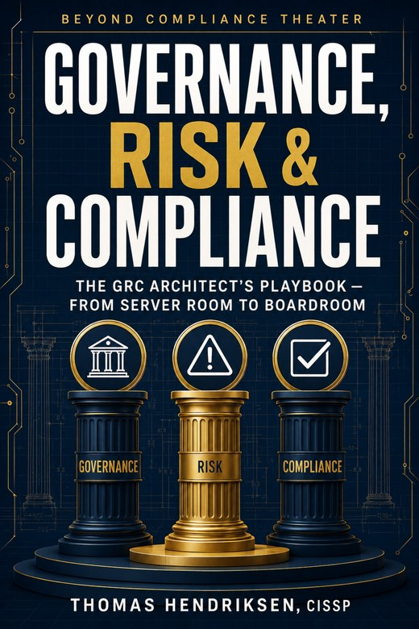

# GRC Architect — Companion Template Repository

> **The GRC playbook for the EU AI Act enforcement year — and the frameworks that run beside it.**



Production-grade, fill-and-modify templates for **"The Governance, Risk and
Compliance Architect: Building Resilient Frameworks for the AI Era"** by
Thomas Hendriksen (xenprotocol), First Edition (2026).

**42 templates across 8 domains**, every one following the book's
conventions: ISO 27001:2022 Annex A control numbering (A.X.XX), exact
regulatory dates, the IIA Three Lines Model, and fill-in fields marked with
`[___]` brackets. Adapt each template to your organization's context — never
deploy a template unmodified.

## Buy the Book

**Amazon Kindle:** [The Governance, Risk and Compliance Architect](https://www.amazon.com/dp/B0G44BCZ4P) — ASIN B0G44BCZ4P
**Paperback:** coming to Amazon
**Free sample:** [samplers/grc-architect-sample-90day.pdf](samplers/grc-architect-sample-90day.pdf) — the book's "First 90 Days of Governance" plan

## What's Inside

| Domain | Templates | Highlights |
| :----- | :-------- | :--------- |
| `isms/` | 13 | ISO 27001:2022 core suite — policy, SoA, risk register, internal audit, incident response |
| `governance/` | 5 | ISSC charter, meeting minutes, policy exceptions, access-control tiering |
| `risk/` | 4 | Asset inventory, risk assessment worksheet, executive summary, risk communication |
| `audit/` | 4 | Audit plan, access-control checklist, corrective action (5-Whys), code-deployment checklist |
| `privacy-ai/` | 7 | ROPA, DPIA, retention, AI governance register, AI system card, provider/deployer RACI |
| `resilience/` | 3 | BIA one-pager, press statement, third-party exit strategy |
| `ot/` | 2 | OT asset inventory + security readiness (IEC 62443, zones & conduits) |
| `checklists/` | 4 | Management review inputs, first-90-days, security champion charter, human-risk plan |

Every template in the book links directly to its fillable file in this
repository — 31 per-template pointers across 9 chapters.

## Quick Start

1. Clone or download this repository.
2. Open the `README.md` inside each domain folder for the template index and
   usage notes.
3. Copy a template, replace every `[___]` field, and route it through your
   normal document control (version, owner, approval).

**Prefer forms?** The `docx/` folder contains every template as a **fillable
Microsoft Word form** (also opens in LibreOffice/OpenOffice): Tab between
fields, pick from drop-down lists (e.g. `[Yes/No]`, treatment options), and
save. See `docx/README.md` for details.

## Structure

```
grc-templates/
├── isms/            Core ISMS suite (ISO 27001:2022)
│   ├── information-security-policy.md
│   ├── isms-scope.md
│   ├── statement-of-applicability.md
│   ├── risk-assessment-methodology.md
│   ├── risk-register.md
│   ├── risk-treatment-plan.md
│   ├── risk-acceptance-form.md
│   ├── internal-audit-procedure.md
│   ├── internal-audit-report.md
│   ├── management-review-minutes.md
│   ├── incident-response-plan.md
│   ├── supplier-security-assessment.md
│   └── business-continuity-policy.md
├── governance/      Governance bodies and policy lifecycle
│   ├── issc-charter.md
│   ├── issc-meeting-minutes.md
│   ├── policy-exception-request.md
│   ├── access-control-policy-tier2.md
│   └── governance-readiness-checklist.md
├── risk/            Risk management artifacts
│   ├── asset-inventory.md
│   ├── risk-assessment-worksheet.md
│   ├── executive-risk-summary.md
│   └── risk-communication-template.md
├── audit/           Audit lifecycle artifacts
│   ├── internal-audit-plan.md
│   ├── audit-checklist-access-control.md
│   ├── corrective-action-plan.md
│   └── code-deployment-checklist.md
├── privacy-ai/      Privacy, data protection, and AI governance
│   ├── ropa.md
│   ├── dpia.md
│   ├── retention-policy.md
│   ├── ai-governance-register.md
│   ├── ai-system-card.md
│   ├── ai-acceptable-use-policy.md
│   └── ai-provider-deployer-raci.md
├── resilience/      Operational resilience and business continuity
│   ├── bia-one-page.md
│   ├── press-statement.md
│   └── third-party-exit-strategy.md
├── ot/              Operational technology (IEC 62443)
│   ├── ot-asset-inventory.md
│   └── ot-security-readiness-checklist.md
├── checklists/      Cross-cutting checklists
│   ├── management-review-inputs.md
│   ├── first-90-days-governance.md
│   ├── security-champion-charter.md
│   └── human-risk-90-day-plan.md
├── docx/            Fillable Word-form versions of every template
├── scripts/         md2docx.py + batch_docx.py (markdown -> fillable .docx)
└── README.md        This file
```

## License

MIT — see [LICENSE](LICENSE). Templates are free to use, adapt, and
redistribute for internal organizational use. The book itself is a separate
copyrighted work.

## Verification

- All templates use `[___]` for fill-in fields (LaTeX-safe, book convention).
- Annex A controls referenced as `A.X.XX` (never "Clause 5.15").
- Regulatory dates match the book's verified enforcement dates (EU AI Act
  high-risk obligations 2 Aug 2026; DORA 24h/72h/1-month clocks; CRA
  December 2027).
- "Three Lines Model" (IIA 2020), never "Three Lines of Defense".

## Also by the Author

**LLM Penetration Testing & AI Security** — the hands-on guide to breaking and
hardening LLMs and autonomous agents, with **105 tested Python examples** in
its companion repository: [github.com/xenprotocol/llm-pentesting-book](https://github.com/xenprotocol/llm-pentesting-book)
